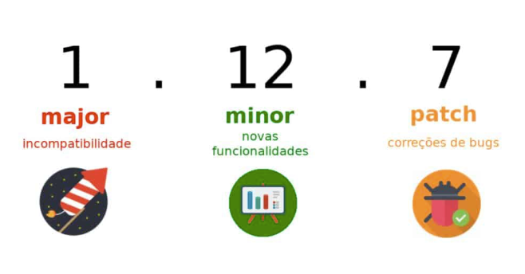
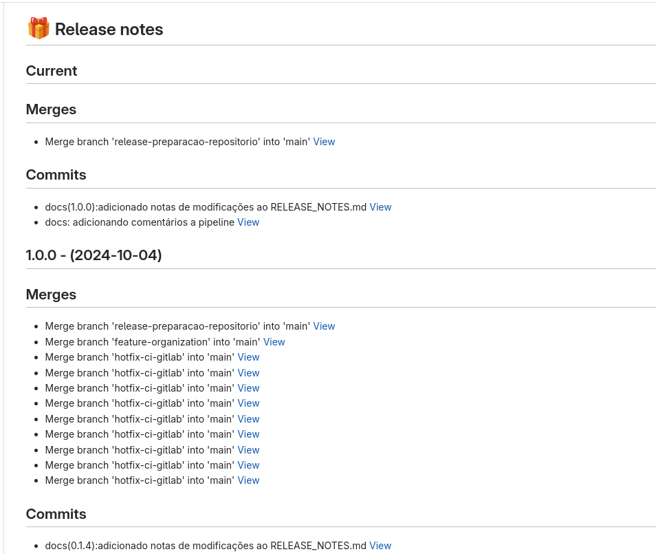

## Autochangelog

Tópicos levados em consideração:

```
- Commits semânticos
- Template personalizado para PR
- Versionamento semântico
- Changelog
- Automação para gerar entradas de changelog a cada commit realizado
```

## Commits Semânticos

Em relação aos commits semânticos, seguiremos as diretrizes ja definidas utilizando como uma base padrão o Gitflow, para maior detalhamento, segue abaixo link da documentação e fluxo que norteia esse seguimento.

[Link Documentação](link)

> Importante lembrar:

- Crie commits objetivos:

Os commits descrevem o que foi realizado na alteração que você criou. Por isso, é fundamental descrevê-los com informações relevantes. Criar comentários como “correção de bug” e “nova funcionalidade”, sem maiores detalhes, não ajudará outras pessoas a compreenderem o que foi feito.

- Crie branchs com nomes claros

Garanta que a ramificação que você criou possui um nome significativo. Assim, em projetos muito grandes e com várias pessoas atuando, será mais fácil encontrar o que você modificou e rapidamente entender qual parte do código foi alterada.

- Mantenha a branch principal atualizada

É a partir da ramificação principal que vamos criar outras aos quais iremos realizar nossas alterações. Por isso, é necessário mantê-la sempre atualizada. Assim, teremos a versão mais recente do código e evitaremos conflitos com alterações existentes, mas às quais não estavam presentes no código de trabalho.

- Faça revisão de código

Um potente recurso disponível em diversas ferramentas de versionamento de código é o Code Review (Revisão de Código). Nesse caso, você poderá acionar uma outra pessoa autorizada a acessar o projeto para revisar as suas alterações e garantir que as mudanças poderão ser incorporadas ao código principal. Isso reduz o número de bugs e de código despadronizado. 

## Template personalizado para PR

Para garantir um padrão de informação no PR será criado um template com algumas informas necessárias que ainda serão definidas.

Proposta de template:

```md
## Descrição

<!-- Inclua um resumo das alterações e do problema relacionado. Inclua também motivação e contexto relevantes. Liste todas as dependências necessárias para essa alteração. -->

## Tipo de mudança

<!-- Exclua as opções que não são relevantes. -->

- [ ] Correção de bug (alteração ininterrupta que corrige um problema)
- [ ] Novo recurso (alteração ininterrupta que adiciona funcionalidade)
- [ ] Alteração na documentação
- [ ] Outro (especifique)

## Pre-merge Checklist

- [ ] Meus commits estão de acordo com a padronização de commits e branchs estabelecidos. [Gitflow]
- [ ] Realizei uma auto-revisão do meu código
- [ ] Comentei meu código, principalmente em áreas difíceis de entender

## Emitir número e link do ticket

- [ ] Não possui relação com Issues nem projetos
- [ ] PR possui relação com uma task de um Projeto [00000](https://dev.azure.com/gmservice/GMS-PLAT4M/_backlogs/backlog/GMS-SQUAD-DEVOPS/Epics)
- [ ] PR possui relação com uma task de um de uma Fetaure de manutenção/melhoria [00000](https://dev.azure.com/gmservice/GMS-PLAT4M/_backlogs/backlog/GMS-SQUAD-DEVOPS/Epics)
- [ ] PR possui relação com um ticket [DIT-00000](https://grupomateus.atlassian.net/jira/servicedesk/projects/DIT/queues/custom/1126)
- [ ] PR possui relação com sobreaviso [DIT-00000](https://grupomateus.atlassian.net/jira/servicedesk/projects/DIT/queues/custom/1126)
- [ ] PR possui relação com uma GMUD [DIT-00000](https://grupomateus.atlassian.net/jira/servicedesk/projects/DIT/queues/custom/1126)
- [ ] Outro (especifique)

## Screenshots

| Before | After |
| ------ | ----- |
| N/A  | N/A |

<!-- Caso quera adicionar alguma imagem, coloque representando o antes e depois substituindo "N/A">
```


## Versionamento Semântico

O versionamento semântico garante organização e ajuda a comunicar atualizações às pessoas usuárias

<p align="center">
  
</p>

## Changelog

Documentar alterações realizadas, seja atualizações, manutenções, correções de bugs, novas funcionalidades e etc. O intuito é criar um documento para registrar pequenas notas relacionadas a esssas mudanças, organizando e agrupando por tags. 

## Automação para gerar entradas de changelog a cada commit realizado

Buscando não burocratizar e nem gerar tanto trabalho pra realização do processo, a intenção é automatizar pelo menos a parte de registrar as mudanças no documento, onde o individuo que está realizando as alterações terá que apenas se preocupar em escrever commits e features claras e objetivas, descrever bem o PR e ao final da operação (Ação de correção/manutenção/nova funcionalidade) seja incrementado uma versão nova em um arquivo `.md` a ser definido e commita-lo. No final do processo, os registros serão lançados de forma organizada por versão em um arquivo parecido com a imagem abaixo:

<p align="center">
  
</p>
